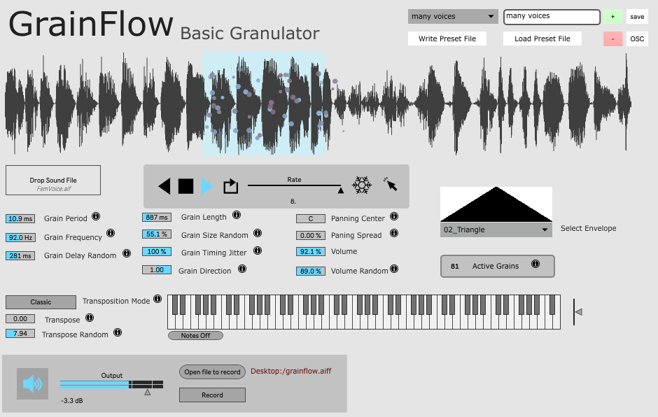

# grainflow basic granulator app
A basic application for granulation using my grainflow library for max msp

This is a max msp project that can be compiled to an application for easy use and could also be easily ported to a max for live device.  I am hesitant on doing this because m4l does not handle poly~ multithreading very elegantly which would lead to a cpu bottleneck

I am working on a release of a grainflow package and will post a link here when it is complete. 
